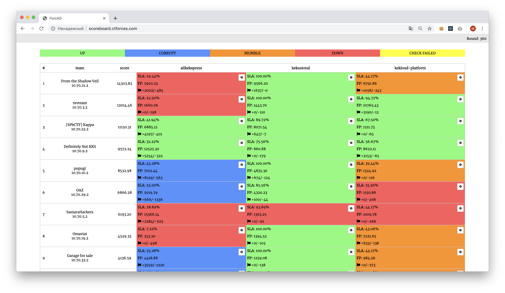

# Attack-Defence тренировка от C4T BuT S4D

Исходные коды сервисов, чекеры и сплоиты с тренировки 15 сентября 2019.

## Результаты

[Полный финальный скорборд](scoreboard/full.png)

## Сервисы

| Сервис | Язык | Чекер | Сплоиты | Автор |
|--------|------|-------|---------|-------|
| **[alikekspress](services/alikekspress/)** | Python | [Чекер](checkers/alikekspress/) | [Сплоиты](sploits/alikekspress/) | [@pomo-mondreganto](https://github.com/pomo-mondreganto) |
| **[kekustotal](services/kekustotal/)** | Golang | [Чекер](checkers/kekustotal/) | [Сплоиты](sploits/kekustotal/) | [@xmikasax](https://github.com/xmikasax) |
| **[kekloud-platform](services/kekloud-platform/)** | C | [Чекер](checkers/kekloud-platform/) | [Сплоиты](sploits/kekloud-platform/) | [@keltecc](https://github.com/keltecc) |

## Образ

- Ubuntu 18.04.1 LTS
- Alpine/Ubuntu in Docker
- [Архив сервисов для команд](services/services.zip) ([Генерация](services/makezip.sh))

## Инфраструктура

- DevOps: [@pomo-mondreganto](https://github.com/pomo-mondreganto)
- Проверяющая система: [ForcAD](https://github.com/pomo-mondreganto/ForcAD)

## Разбор

[Разбор](https://www.youtube.com/watch?v=twM9eExiLhM)
